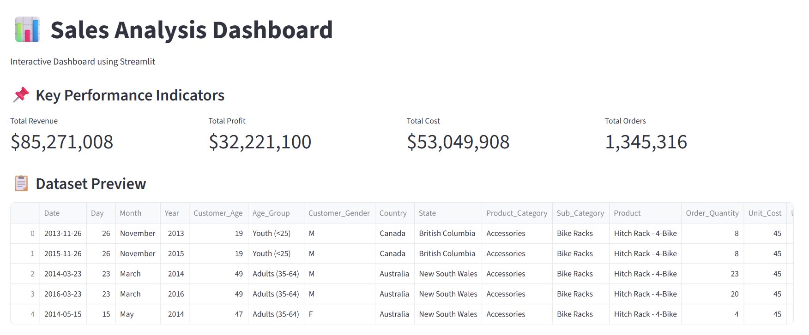
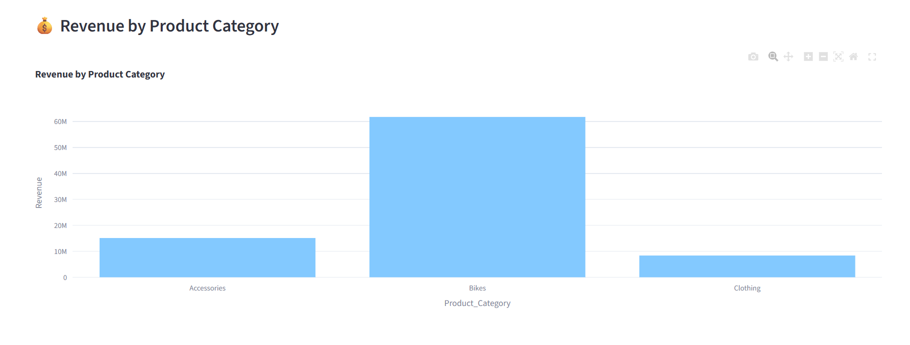
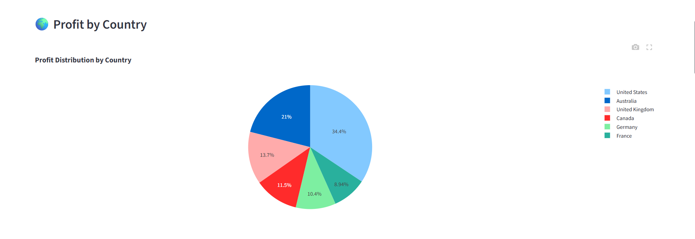
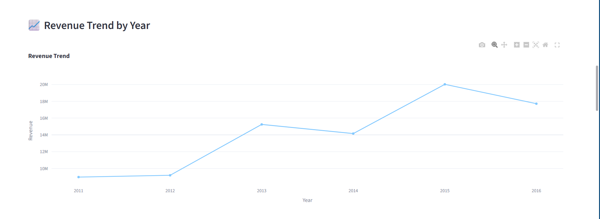
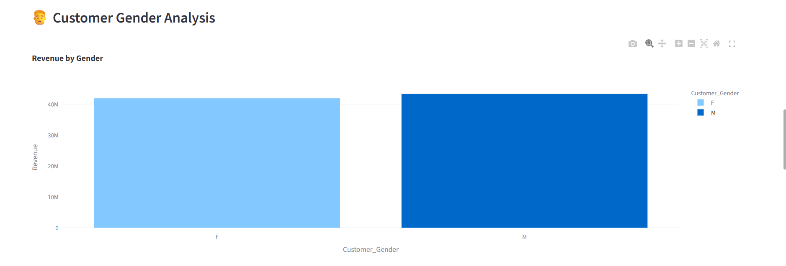
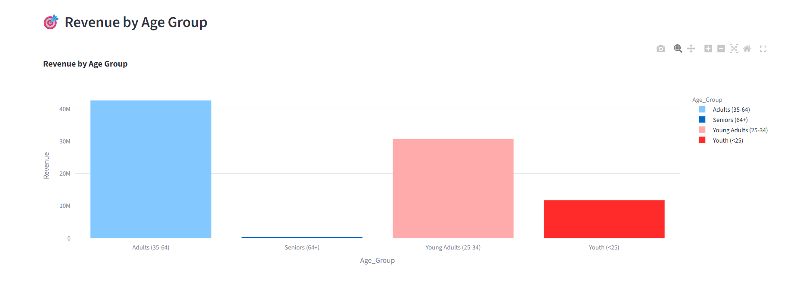
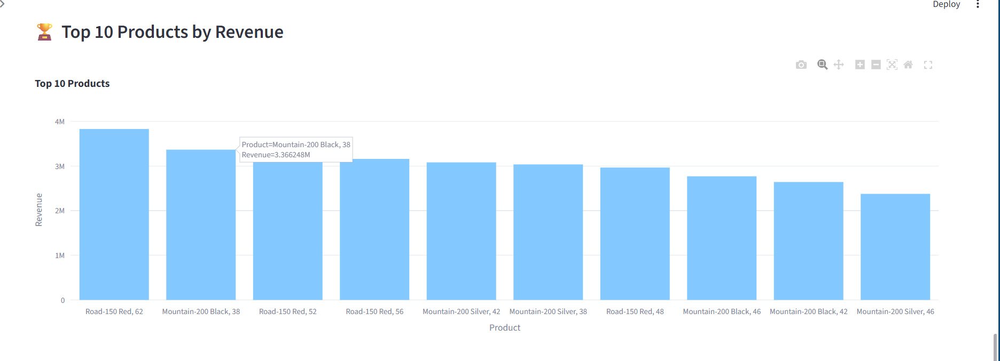
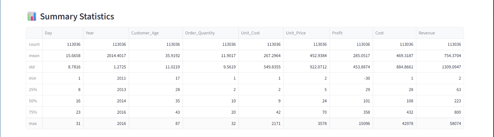

# 📊 Global- Sales- Performance Dashboard

<div align="center">

### 🚀 Interactive Sales Analytics Dashboard using Streamlit

Transforming Raw Sales Data into Actionable Business Insights


</div>

---

## 📌 Project Overview

The **Sales Insights Dashboard** is an interactive Business Intelligence solution developed using **Streamlit, Pandas, and Plotly**.

The dashboard enables users to explore sales performance, analyze customer behavior, monitor profitability, and identify business trends through dynamic visualizations and KPI tracking.

---

## 🎯 Project Objectives

✔ Analyze Revenue, Profit, and Cost

✔ Understand Customer Demographics

✔ Track Product Performance

✔ Generate Business Insights

✔ Enable Data-Driven Decision Making

✔ Build an Interactive Dashboard Experience


# 📸 Dashboard Preview
<h1>Dashboard<h1>
<p align="center">
  
</p>

<p align="center">
  
</p>

<p align="center">
  
</p>

<p align="center">
  
</p>

<p align="center">
  
</p>

<p align="center">
  
</p>

<p align="center">
  
</p>

<p align="center">
  
</p>


# ✨ Key Features

### 📊 Business KPIs

* Total Revenue
* Total Profit
* Total Cost
* Total Orders

### 🔍 Interactive Filters

* Country Filter
* Gender Filter
* Year Filter

### 📈 Interactive Visualizations

* Revenue Analysis
* Profit Analysis
* Product Category Insights
* Customer Demographics
* Trend Analysis
* Product Performance Analysis

### ⬇ Export Functionality

* Download Filtered Data
* CSV Export Support

---

# 🛠️ Technology Stack

| Technology  | Purpose                   |
| ----------- | ------------------------- |
| Python      | Core Programming          |
| Streamlit   | Dashboard Development     |
| Pandas      | Data Analysis             |
| Plotly      | Interactive Visualization |
| CSV Dataset | Data Source               |

---

# 📂 Project Structure

```text
Sales-Insights-Dashboard/
│
├── app.py
├── Sales.csv
├── requirements.txt
├── README.md
│
└── images/
    ├── A.png.png
    ├── B.png.png
    ├── C.png.png
    ├── D.png.png
    ├── E.png.png
    ├── F.png.png
    ├── G.png.png
    └── H.png.png
```

---

# ⚙️ Installation Guide

### Clone Repository

```bash
git clone https://github.com/your-username/sales-insights-dashboard.git
```

### Navigate to Project

```bash
cd sales-insights-dashboard
```

### Create Virtual Environment

```bash
python -m venv venv
```

### Activate Environment

```bash
venv\Scripts\activate
```

### Install Dependencies

```bash
pip install -r requirements.txt
```

### Run Dashboard

```bash
python -m streamlit run app.py
```

---

# 📊 Dataset Attributes

The dataset contains:

* Revenue
* Profit
* Cost
* Product Category
* Product
* Country
* Customer Gender
* Age Group
* Order Quantity
* Sales Year

---

# 📈 Business Insights Generated

### Revenue Analysis

Identify top-performing categories and products.

### Profitability Tracking

Monitor business profit across different regions.

### Customer Segmentation

Analyze purchasing patterns based on demographics.

### Trend Analysis

Track yearly sales performance and growth.

### Product Performance

Discover best-selling products and revenue contributors.

---

# 🎓 Skills Demonstrated

* Data Analysis
* Business Intelligence
* Dashboard Development
* Data Visualization
* KPI Reporting
* Interactive Reporting
* Python Programming
* Streamlit Development

---

# 👨‍💻 Author

## Satyam Sharma

🎓 B.Tech – AI & Data Science

📊 Aspiring Data Analyst

📈 Business Intelligence Enthusiast

🤖 Machine Learning Learner

---

<div align="center">

### ⭐ If you found this project useful, please consider giving it a star.

</div>
